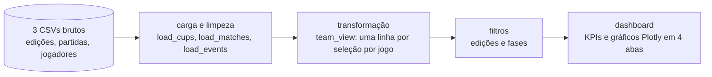

# Dashboard da Copa do Mundo (1930–2014)

**Página no portfólio:** https://dev-pprado.github.io/projetos/worldcup-dashboard/

Dashboard em Streamlit para explorar 84 anos de Copa do Mundo: 20 edições, 836 partidas e 2.379 gols. Os CSVs públicos chegam com linhas vazias, partidas duplicadas, nomes de seleções inconsistentes e eventos de jogadores codificados em texto. O projeto limpa e modela esses dados com pandas e entrega o resultado em KPIs, filtros e gráficos Plotly.

## O fluxo de dados



Tudo fica em [`dashboard.py`](dashboard.py), organizado em camadas:

| Camada | O que faz |
|---|---|
| **Carga e limpeza** | `load_cups`, `load_matches` e `load_events` leem os CSVs e corrigem os problemas de qualidade (tabela abaixo). Ficam em cache com `@st.cache_data`, então a limpeza roda uma vez só. |
| **Transformação** | `team_view` passa as partidas para o formato longo, com uma linha por seleção por jogo e o resultado (vitória, empate ou derrota) do ponto de vista de cada uma. |
| **Apresentação** | Filtros na barra lateral, KPIs e gráficos organizados em abas. Todos reagem aos filtros. |

### Dados

Base pública *FIFA World Cup* (Kaggle), com dados oficiais da FIFA de 1930 a 2014.

| Arquivo | Linhas (bruto) | Linhas (tratado) | Granularidade |
|---|---:|---:|---|
| `WorldCups.csv` | 20 | 20 | Edição |
| `WorldCupMatches.csv` | 4.572 | 836 | Partida |
| `WorldCupPlayers.csv` | 37.784 | 37.048 | Jogador × partida |

### Tratamento de dados

| Problema | Exemplo | Tratamento |
|---|---|---|
| Linhas totalmente vazias | ~3.700 linhas em `WorldCupMatches.csv` | `dropna(how="all")` |
| Partidas duplicadas | 16 jogos repetidos (2014 aparecia com 80 jogos em vez de 64) | `drop_duplicates(subset="MatchID")` |
| Registros de jogadores duplicados | 736 linhas | `drop_duplicates()` |
| Resíduo de HTML nos nomes | `rn">Republic of Ireland` | Remoção por regex |
| Erro de encoding | `C�te d'Ivoire` | Mapeado para `Côte d'Ivoire` |
| Mesma seleção com dois nomes | `IR Iran` e `Iran` | Unificado como `Iran` |
| Ponto como separador de milhar | `1.045.246` | Convertido para inteiro |
| Espaços sobrando | `"Montevideo "` | `str.strip()` |
| Data e hora em texto | `"13 Jul 1930 - 15:00 "` | `pd.to_datetime` com formato explícito |
| Nomes de fase heterogêneos | `Group A`, `Group 1`, `Third place`, `Play-off for third place` | Padronizados em 8 fases em português |
| Eventos codificados em texto | `"Y1' O86'"`, `"G40'"` | Extraídos com `str.extractall` para uma linha por evento (código + minuto) |

Códigos de evento dos jogadores: `G` gol, `P` gol de pênalti, `MP` pênalti perdido, `Y` amarelo, `R` vermelho direto, `RSY` vermelho pelo segundo amarelo, `I`/`O` entrou/saiu, `IH`/`OH` entrou/saiu no intervalo.

### Regras de negócio

- **Alemanha:** `Germany FR` (Alemanha Ocidental) conta como `Germany`, seguindo o critério da FIFA. A Alemanha Oriental (`German DR`) continua separada.
- **Vencedor da partida:** definido pelo placar. Em empate, a vitória nos pênaltis é extraída do campo `Win conditions`.
- **Estatísticas das seleções:** jogos decididos nos pênaltis contam como empate, como nas estatísticas oficiais.
- **Aproveitamento:** `(3 × vitórias + empates) ÷ (3 × jogos)`.
- **Artilharia:** soma gols normais (`G`) e de pênalti (`P`).

### Validação

Os números do dashboard foram conferidos com fontes independentes:

| Verificação | Resultado |
|---|---|
| Soma dos gols das partidas tratadas × `GoalsScored` em `WorldCups.csv` | 2.379 = 2.379 |
| Partidas por edição após remover duplicatas | 2014: 64 jogos |
| Brasil 1930–2014 (histórico oficial da FIFA) | 20 Copas, 104 jogos, 70 vitórias, 221 gols |

## O dashboard

**Filtros (barra lateral):** intervalo de edições e fases do torneio.

**KPIs:** edições, partidas, gols, média de gols por jogo, público total e maior campeão do período.

| Aba | Conteúdo |
|---|---|
| **Visão geral** | Gols por edição, média de gols por partida, títulos por seleção, público médio, pódios das 10 seleções com mais aparições, média de gols por fase e as 10 maiores goleadas. |
| **Seleções** | Ranking das 15 seleções com mais vitórias e mais gols, análise de uma seleção escolhida (jogos, vitórias, saldo, aproveitamento, resultados por edição) e tabela completa com barra de aproveitamento. |
| **Jogadores** | Gols registrados, gols de pênalti, cartões e expulsões, top 15 artilheiros e gols por faixa de minuto. |
| **Dados** | Tabelas tratadas de edições e partidas e download em CSV das partidas filtradas. |

## Stack

| Parte | Tecnologias |
|---|---|
| Dados | Python 3.10+, pandas |
| Visualização | Streamlit, Plotly |

## Como rodar localmente

Pré-requisito: Python 3.10 ou superior.

```sh
git clone https://github.com/Dev-PPrado/WorldCup.git
cd WorldCup

python -m venv .venv
source .venv/bin/activate          # Windows: .venv\Scripts\activate
pip install -r requirements.txt

streamlit run dashboard.py         # abre em http://localhost:8501
```

## Estrutura

```text
.
├── data/
│   ├── WorldCups.csv          # uma linha por edição (sede, pódio, gols, público)
│   ├── WorldCupMatches.csv    # uma linha por partida
│   └── WorldCupPlayers.csv    # escalações e eventos por jogador
├── dashboard.py               # carga, limpeza, transformação e dashboard
└── requirements.txt
```

## Limitações conhecidas

- **Nomes acentuados em `WorldCupPlayers.csv`:** chegaram com `?` no lugar da letra (ex.: `PEL?`, `M?LLER`). A informação se perdeu na origem e não dá para recuperar pelo arquivo.
- **Gols por jogador:** somam 2.338, contra 2.379 nas partidas. A diferença vem principalmente de 41 eventos com código `W`, provavelmente gols contra (não há documentação que confirme), que ficam fora da artilharia.
- **Cobertura:** a base vai até 2014. As Copas de 2018 e 2022 não estão incluídas.

## Próximos passos

- [ ] Incluir as Copas de 2018 e 2022
- [ ] Separar o ETL em um módulo próprio e salvar os dados tratados em Parquet
- [ ] Testes automatizados das regras de limpeza
- [ ] Mapa de participações e títulos por país
- [ ] Publicar no Streamlit Community Cloud
